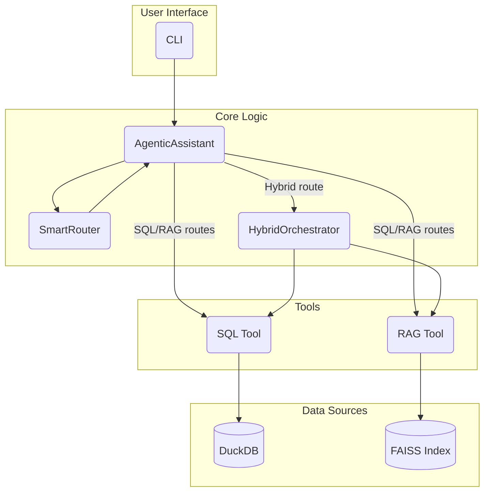

# Agentic Q&A Assistant — Technical Design

This document is a companion to README.md. It covers the system’s architecture, design choices, tradeoffs, and operational details across PDF/text ingestion, RAG, SQL, routing, hybrid orchestration, token usage tracking, CLI, and more. It is intended for engineers who will extend, operate, or review the system.

## Scope and Goals

- Combine structured analytics (SQL) with unstructured retrieval (RAG) under a single CLI.
- Maintain strong safety: read-only SQL, validated queries, source-cited answers.
- Keep the implementation explicit and framework-light to optimize transparency and control.
- Provide useful observability (integrity checks, EXPLAIN plans, token usage reports).

Non-goals in the current iteration:

- Production-grade horizontal scalability (single-process CLI focus).
- Full-blown agent graph orchestration frameworks.

## High-level Architecture



Key components:

- CLI: click-based entry points for chat, ask, and demo.
- Router: hybrid rule-based + (optional) LLM classification to choose SQL, RAG, or HYBRID.
- SQL Tool: safe SQL generation (LLM) + AST validation (sqlglot) + DuckDB execution.
- RAG Pipeline/Tool: document ingestion (PDF/text), chunking, embeddings (OpenAI), FAISS search, and answer synthesis with citations.
- Hybrid Orchestrator: executes SQL and RAG in parallel and composes a coherent answer.
- Cost/Token Tracker: collects per-model token usage, with optional persistence to JSON.

## Data Sources and Storage

### Structured (SQL) data

- CSVs live under `data/`:
  - DIM_MODEL.csv, DIM_COUNTRY.csv, DIM_ORDERTYPE.csv, FACT_SALES.csv, FACT_SALES_ORDERTYPE.csv
- Loaded into an in-memory DuckDB each run.
- Schema is created explicitly; CSVs are loaded via pandas and inserted with explicit column lists to avoid positional mismatches (bug classically observed with DIM_COUNTRY column order).
- Integrity checks log:
  - Row counts per table
  - Orphaned fact rows by model_id / country_code
  - Summary statistics (total contracts, year range, distinct months)

### Unstructured (RAG) corpus

- Documents live under `docs/` (PDF and text).
- Index artifacts (FAISS + metadata) are saved under `./vector_index`:
  - index.faiss (vectors), chunks.pkl (metadata), embeddings.npy (dense matrix)
- On startup, the pipeline attempts to load an existing index; otherwise it ingests and builds anew.

## Document Ingestion and RAG Design

### File handling

- Text (`.txt`, `.md`): read as UTF-8; cleaned with basic whitespace normalization; split into token-based chunks.
- PDFs (`.pdf`): extracted using pdfplumber page-by-page; text cleaned and chunked identically to `.txt`.
- Unsupported types are skipped with warnings.

### Cleaning and Chunking

- Tokenizer: `tiktoken` (`cl100k_base`).
- Chunk size ≈ 600 tokens with 100 token overlap (tunable) to keep context windows efficient while preserving continuity.
- Metadata per chunk: source filename, page (or 1 for text files), doc_type (contract/warranty/manual/unknown), brand inference where applicable, year inferred from filename, and a region default (“Europe”) per the PRD context.

### Embeddings and Indexing

- Embeddings: OpenAI `text-embedding-3-small` (dimension 1536).
- Index: FAISS `IndexFlatIP` (cosine similarity via L2-normalized vectors).
- Persistence: index + embeddings + chunk metadata saved to `./vector_index` after build.
- Search: query embedded, normalized, searched against FAISS; top-k returned as (Chunk, score, rank).

### Token usage for embeddings

- If OpenAI embeddings API provides `usage.total_tokens`, we record it.
- Otherwise, we estimate total tokens for the batch with `tiktoken` and record the estimate.

## Answering with RAG

- RAG Tool performs:
  1) Retrieval: issue FAISS search for top-k results, filter by threshold and optional doc_type.
  2) Synthesis: call an LLM (model configurable) with a system instruction enforcing:
     - Use only provided context
     - Include inline citations `[source p.X]`
     - Be precise, quote exact phrases where helpful
     - Return a clear, concise answer
  3) Citation formatting pass to convert `[1]`-style into `[Document p.X]` with source names.
- Observability: number of chunks, retrieval and synthesis latencies, confidence proxy.
- Latency optimization: when the primary model is a reasoning model (`gpt-5-*`, `o*`), default to a faster synthesis model (e.g., `gpt-4o-mini`).

## SQL Subsystem

### DuckDB and schema

- In-memory DuckDB for speed and zero external dependencies.
- Explicit schemas for dimensions and fact tables.
- Data loading enforces column order to avoid positional mismatches; inserts list explicit columns.
- Integrity verification run post-load.

### SQL generation and safety

- The SQL Tool:
  - Generates a single SELECT via OpenAI chat completion with an instruction that includes a human-readable schema and best-practice rules.
  - Parses the generated SQL with `sqlglot` (DuckDB dialect) to enforce:
    - Only SELECT
    - Allowed table and column allowlists
    - Denied statements/functions (CREATE, INSERT, PRAGMA, etc.)
    - LIMIT safety (<= 10,000 rows)
- Query execution via DuckDB, returning rows and a simple column extraction from the AST. Timeout is enforced at the call-site level (DuckDB doesn’t have a built-in timeout primitive).

### EXPLAIN plans

- CLI flags:
  - `--explain` prints DuckDB EXPLAIN before execution
  - `--explain-analyze` prints EXPLAIN ANALYZE
- Available in both `ask` and `demo` commands. If a demo question is routed to SQL, the plan is shown.

## Router

### Rule-based router

- Keyword groups indicating SQL, RAG, and HYBRID intents (e.g., time/location/metrics vs. warranty/manual/policy vs. comparison/summary)
- Confidence derived from the number of matched groups.

### LLM fallback (optional)

- For low-confidence cases, a lightweight LLM classifier can be invoked to predict SQL/RAG/HYBRID.
- Combined reasons are shown when fallback is used.
- Default runtime behavior leans on rules and only falls back when confidence is insufficient.

## Hybrid Orchestration

- Executes SQL and RAG in parallel (ThreadPoolExecutor) to minimize end-to-end latency.
- Returns both traces (execution time, row counts, chunk counts, etc.).
- Composes a unified answer (LLM vs. fallback formatting if LLM composition fails or is not desired).

## Token Usage Tracking

### What we record

- Per-model fields:
  - input_tokens (prompt)
  - input_cached_tokens (cached prompt tokens, if provided by the API)
  - output_tokens (completion)
  - reasoning_tokens (if provided by the API)
  - total_tokens (sum/usage.total_tokens when available)
  - embedding_tokens (from embeddings.create usage or estimator)

### Where it’s displayed and saved

- “Token Usage” panel is printed:
  - After SQL-only results
  - After Hybrid answers
- CLI flags to save a machine-readable report:
  - `--token-report <path>` for `demo` (written after all questions)
  - `--token-report <path>` for `ask` (written after the single question)
  - `--token-report <path>` for `chat` (written on exit: Ctrl+C)

### Mapping tokens to currency

- We intentionally do not compute costs in the app. You can convert the JSON report to USD/EUR externally using your own pricing tables (which vary per model and region and may change).

## CLI Overview

- `agentic-qa chat` — interactive session
  - Options: `--trace`, `--integrity-report <file>`, `--token-report <file>`, `--data-dir`, `--docs-dir`, `--model`, `--openai-key`
- `agentic-qa ask "Your question..."` — single question
  - Options: `--trace`, `--explain`, `--explain-analyze`, `--integrity-report <file>`, `--token-report <file>`, `--data-dir`, `--docs-dir`, `--model`, `--openai-key`
- `agentic-qa demo` — runs 4 PRD demo questions
  - Options: `--explain`, `--explain-analyze`, `--integrity-report <file>`, `--token-report <file>`, `--data-dir`, `--docs-dir`, `--model`, `--openai-key`

Environment and config:

- `.env` with `OPENAI_API_KEY` is loaded automatically (dotenv).
- Default model uses a modern OpenAI chat model (`gpt-5-nano` by default). You may override via `--model`.

## Why not PydanticAI / LangGraph (yet)?

While the repo includes dependencies useful for experimentation, the core app intentionally avoids high-level orchestration frameworks like LangGraph or heavier agent stacks because:

- Transparency: The control flow is explicit and readable (simple Python, limited magic).
- Footprint: Fewer moving parts and dependencies reduce friction for local review and hiring exercises.
- Flexibility: We can evolve routing, validation, and composition logic without conforming to a graph or agent abstraction.
- Observability: Custom tracing (EXPLAIN, token usage, integrity reports) tailored to the PRD and data model.

Future work could port the orchestration to a framework if operating constraints shift toward long-running services, multi-turn agent tools, or workflow graphs.

## Tools Implementation Notes

- SQL Tool
  - Generation: LLM prompt includes schema; system message enforces SELECT-only and best practices.
  - Validation: sqlglot AST checks enforce safety and attach a LIMIT if missing.
  - Execution: DuckDB with extracted columns; tables are read-only.

- RAG Tool & Pipeline
  - Ingestion: pdfplumber for PDFs, UTF-8 text for .txt; normalized; chunked with token overlap.
  - Indexing: FAISS inner product with normalized vectors for cosine similarity semantics.
  - Synthesis: LLM with strict instructions to use only context and to include citations.

- Router
  - Fast rule-based pass; optional LLM fallback if confidence low or ambiguous.

- Hybrid Orchestrator
  - Parallel SQL + RAG; robust error capture with trace object; LLM composition for coherent answer.

## Database and Data Model

- DuckDB is used for its speed, simplicity, and zero external dependency requirement.
- Schema aligns with the PRD:
  - Dimensions: MODEL, COUNTRY, ORDERTYPE
  - Facts: SALES and SALES_ORDERTYPE
- Integrity checks ensure joins won’t silently drop rows; warnings are logged for orphaned keys.
- Column-order-safe loading prevents subtle bugs from CSV header ordering.

## Error Handling and Troubleshooting

Common issues:

- Missing data/docs directories when running from a subdirectory: run from the repository root or pass `--data-dir` / `--docs-dir`.
- OpenAI 401 / insufficient scopes: ensure a standard API key or proper scopes for `model.request` and your chosen chat/embedding models.
- Empty RAG index: verify PDFs contain extractable text; OCR scanned PDFs first (e.g., `ocrmypdf`).
- No SQL rows: check integrity logs and try exploration queries (distinct values) to confirm filters (country names, model names, years).

Observability features:

- Integrity report: `--integrity-report <file>` logs row counts and FK sanity checks.
- EXPLAIN / EXPLAIN ANALYZE for SQL: `--explain`, `--explain-analyze`.
- Token usage summary plus JSON export: `--token-report <file>`.

## Security and Safety Considerations

- SQL safety: AST validation prevents write operations and disallowed functions; read-only data.
- Prompt safety: RAG synthesis explicitly requires citation-based grounding; encourages “insufficient evidence” responses if needed.
- Secrets: `.env` for API keys; CLI and logs do not print the secret values. The app never echoes secrets.

## Extensibility

- Storage backends: FAISS can be swapped for pgvector/Qdrant for multi-user/networked deployments.
- Database: DuckDB can be replaced by Postgres; SQL safety checks should remain largely compatible (sqlglot supported).
- Models: swap LLMs or embedding models via flags or configuration; token usage remains consistent.
- Router: add domain-specific rules or custom LLM router prompts.
- CLI: add subcommands (e.g., `index --force`, `pdf-to-text`, `validate-data`).

## Appendix: Example Commands

- Run demo with explain plan and token report:

```bash path=null start=null
uv run agentic-qa demo --explain --token-report tokens.json --model gpt-5-nano
```

- Single question with SQL EXPLAIN ANALYZE and integrity report:

```bash path=null start=null
uv run agentic-qa ask --explain-analyze --integrity-report integrity.txt \
  "Monthly RAV4 HEV sales in Germany in 2024"
```

- Start chat and write token usage on exit:

```bash path=null start=null
uv run agentic-qa chat --token-report tokens_chat.json
```

- Rebuild local vector index (manual approach): delete `./vector_index` and rerun; or add a `--force` flag (future work) to the pipeline step.
